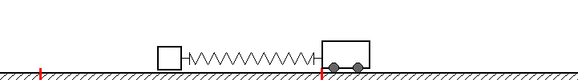

A simple 1-D casting model
=============================
Simulation using a simple 1-D (toy) model of casting
(a car pulling a brick using a linear spring).
    
You can *play with the parameters* to get a feeling for 
how various line weight, rod stiffness, input, etc.
affects the cast and line launch speed.

Brick-spring-car model
------------------------------

The "simplest possible" (limited) model for a fly cast
(or spin cast) is probably the *brick-spring-car*
model. 

In this model the line is replaced by a "brick" which
is pulled along an imaginary frictionless surface
by an imaginary car connected by a spring.
The movement of the car mimics rod leverage, and
the spring mimics the elastic bending and un-bending
of the rod. 

The model is solved numerically (with tunable
parameters and driving), and you can play with the
parameters in the model.  

This can be used to understand and get a feeling for:
* The relation and interplay of "leverage" and "spring"
* Understanding the effect of hard and soft stops
* Understanding the importance of "work path"
 
This model is of course not super original as it is
just a simple forced harmonic oscillator model;
one of the most *used* and *abused* models in physics...

The Streamlit app and the API will let you tune and change
parameters and see the effect on generated speed, work-path-length,
etc.
