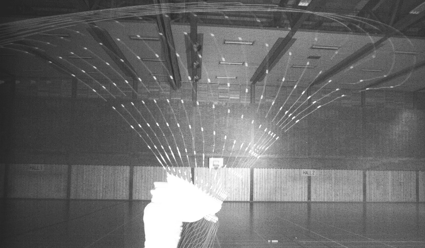

.. flycast documentation master file, created by
   sphinx-quickstart on Wed Apr 21 17:50:40 2021.
   You can adapt this file completely to your liking, but it should at least
   contain the root `toctree` directive.

Fly cast simulator documentation
==================================
Python package and applications for simulating flycasting.
:mod:`flycastsim` is a Python library, and (in the future) a set of command line
scripts/programs for simulating flycasts.

.. toctree::
   :maxdepth: 1
   :glob:
   :caption: Contents:

   brick_spring
   fem
   rod
   planned
   dev
   api/index

Introduction
----------------------

This is the start of an open and free fly casting simulator.

The simulator is both a
`Streamlit <https://streamlit.io/>`_
`app <https://share.streamlit.io/grunde73/flycastsim/main>`_
and a library which you can use
and extend as you like.

The simulator and library is a work in progress which will be  developed in an
ad-hock fashion when I have the time and inspiration.

At the moment the simulator contains:
^^^^^^^^^^^^^^^^^^^^^^^^^^^^^^^^^^^^^^^^^^^
#. A simple 1-D *brick-spring-car* casting model
#. A continuum (finite-element) core engine for a single beam/line subdomain
   with bending, tension and gravity (:mod:`flycastsim.fem`), with optional
   Reynolds-number air drag and Kelvin-Voigt material damping, validated against
   six exact verification cases and exposed as an interactive *sample fly cast*
   demo
#. A **Cast #1** mode that reproduces a real recorded cast from Løvoll &
   Borger's *The Rod & The Cast*: the rod is driven by a rod-butt angle sweep
   fitted to the footage (with a forward hand haul), the full ~12.7 m line +
   leader is modelled, and the simulated rod chord length and tip deflection are
   compared against the measured high-speed video — with an optional imaginary
   rigid-rod overlay in the animation
#. A **rod parameters** tool (:mod:`flycastsim.rod`) estimating a rod's
   *swingweight* (butt-axis moment of inertia)

The following is planned but not implemented:
^^^^^^^^^^^^^^^^^^^^^^^^^^^^^^^^^^^^^^^^^^^^^^^^
#. Coupling of multiple subdomains (rod + line + leader + fly)
#. A full quantitative cast model

See :doc:`planned` for the full, evolving backlog.

The full source code is available on GitHub
`https://github.com/grunde73/flycastsim
<https://github.com/grunde73/flycastsim/>`_.

Quickstart
---------------
The project is managed with `uv <https://docs.astral.sh/uv/>`_. Install uv (see
the `uv installation docs
<https://docs.astral.sh/uv/getting-started/installation/>`_), then from the
terminal do:

.. code-block:: sh

    git clone git@github.com:grunde73/flycastsim.git
    cd flycastsim
    uv sync --extra app
    uv run streamlit run streamlit_app.py

This creates an isolated virtual environment (``.venv``), installs the
``flycastsim`` package together with the app dependencies, and launches the app
in your default browser. uv automatically provisions a compatible Python
interpreter (>= 3.12) for you.

A ``requirements.txt`` (auto-generated with ``uv export``) is also provided for
environments that use plain ``pip``, such as Streamlit Community Cloud:

.. code-block:: sh

    pip install -r requirements.txt
    streamlit run streamlit_app.py

Examples of using the ``flycastsim`` package are found in the
``flysim_examples.ipynb`` Jupyter notebook.

Disclaimer
------------

    "Essentially, all models are wrong, but some are useful."

    George E. P. Box

Remember, models are just models. So be critical and aware
of the limitations and assumptions of all models, including
the ones found here :-D

Indices and tables
======================

* :ref:`genindex`
* :ref:`modindex`
* :ref:`search`
